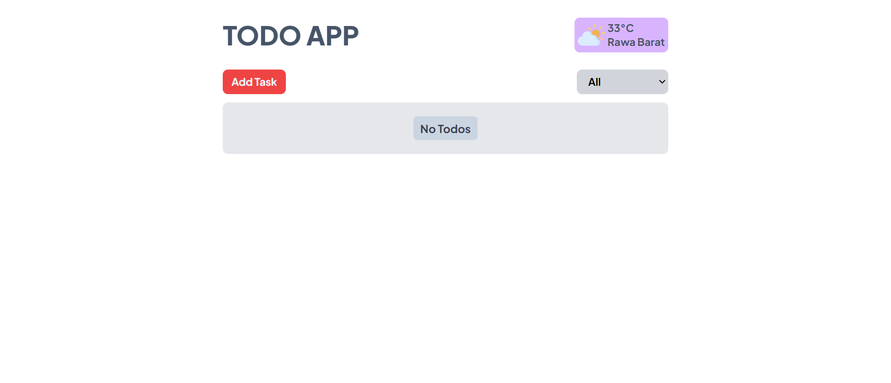
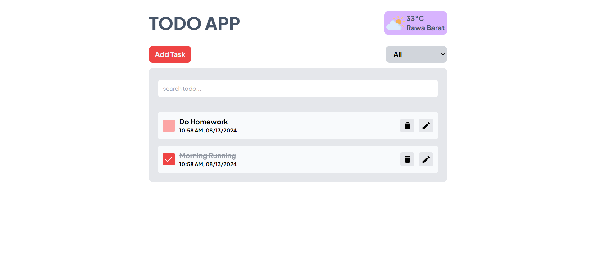
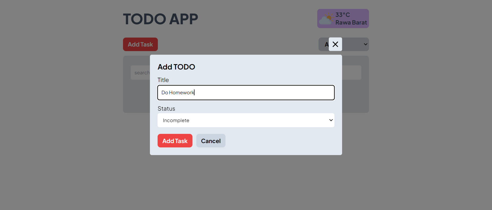
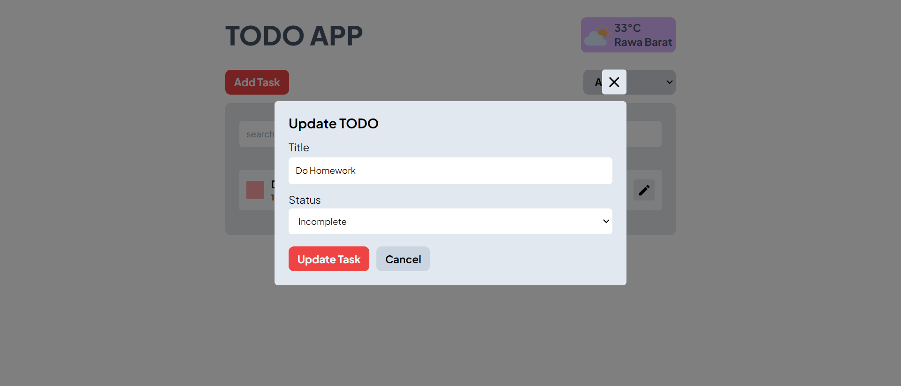

# Demo

https://fe-test-habell-dolosha-purba.netlify.app/dashboard/data-tables

## Screenshots

1. When the todo list is empty

2. When there is a todo list

3. When user want to add task todo

4. When user want to update task todo

